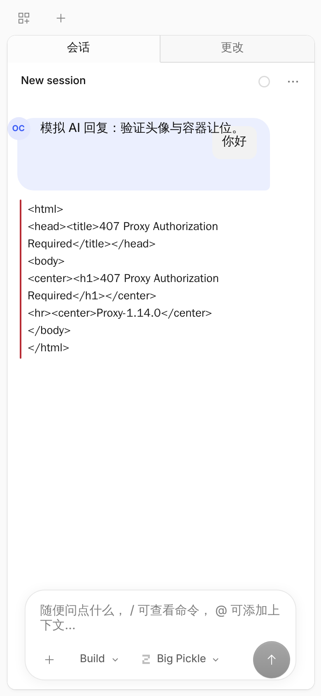
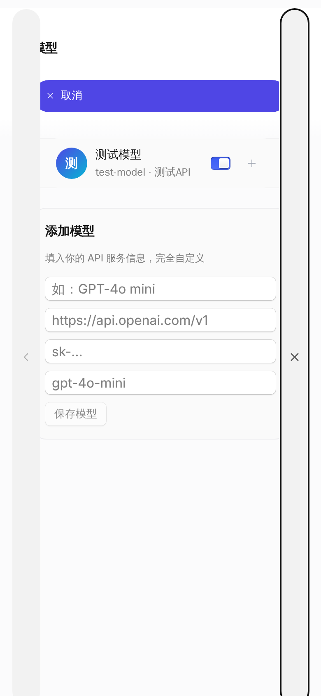
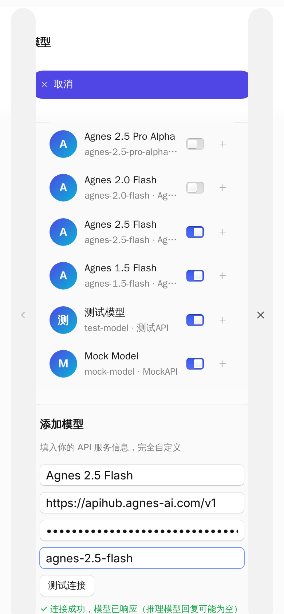
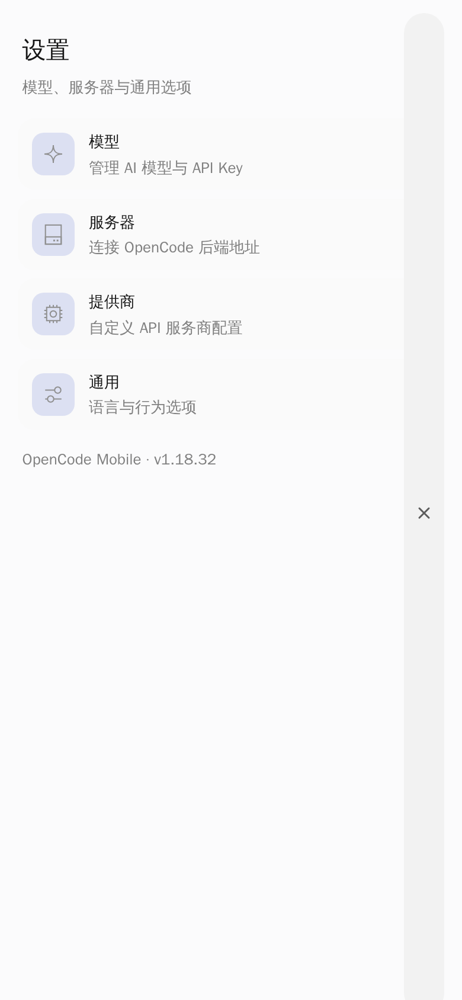

# OpenCode Mobile

> **Run OpenCode — the terminal AI coding agent — on your Android phone.**
> A mobile-native wrapper with a completely custom, mainstream-AI-style UI
> (think ChatGPT / Doubao / Qwen app), 100% BYO-model: **no official services,
> no official models, no vendor lock-in.**

<p align="center">
  
  
  
  
</p>

<p align="center">
  <b>Home · Session · Fully custom models · Test connection</b>
</p>

---

## Why OpenCode Mobile?

[OpenCode](https://github.com/sst/opencode) is a brilliant open-source coding
agent that runs in your terminal. But the web UI was built for desktop, and the
official service tied you to their models.

OpenCode Mobile takes the same engine and **redesigns it for the phone**:

- 📱 **Mobile-first UI** — rebuilt around how mainstream AI apps look and feel:
  message bubbles, a pill composer, a bottom tab bar (Chat / New / Me), full-screen
  settings, bottom sheets for model picking.
- 🔌 **100% custom models** — bring your own OpenAI-compatible API
  (base URL + key + model ID). The official provider and its free tier are
  **completely removed**; nothing phones home.
- ✅ **Test connection built in** — verify your API endpoint right in the add-model
  form before saving.
- 🤖 **Real agent capabilities** — the full OpenCode engine runs on your device:
  chat, file edits, shell commands, agent workflows — powered by *your* model.
- 🔒 **Private by default** — no account, no cloud relay; your conversations go
  straight from the phone to the API provider you configured.
- ⚡ **Runs anywhere** — the whole thing is self-contained; the backend is the
  official `opencode` binary running locally on the phone.

## Screenshots

| Home | Session | Settings home | Models | Test connection |
| --- | --- | --- | --- | --- |
|  |  |  |  |  |

## Quick start

### Install the APK

Grab the latest release APK from the [Releases](../../releases) page (or from
the build instructions below) and install it on your Android device
(`Settings → Install unknown apps` → allow this file).

### First run

1. Open the app → bottom **Me** tab → **Models**.
2. Tap **＋ Add** and fill in:
   - **Display name** — e.g. `GPT-4o mini`
   - **API base URL** — e.g. `https://api.openai.com/v1`
   - **API key** — your key (stays on-device)
   - **Model ID** — e.g. `gpt-4o-mini`
3. Tap **Test connection** — you should see a green `✓ 连接成功`.
4. Tap **Save**, then start chatting. The agent can edit files and run commands
   in its working directory — all through your own model.

> Works with any OpenAI-compatible endpoint. Verified with Agnes AI
> (`https://apihub.agnes-ai.com/v1`, `agnes-2.5-flash`), OpenAI, and local
> OpenAI-compatible servers.

## Build from source

```bash
# 1) Frontend (Web UI) — needs the upstream monorepo, see docs/BUILD.md
cd opencode          # sst/opencode checkout
# apply the web/ sources from this repo (web/packages/app, ui, sdk)
cd packages/app && bun install && bun run build   # → dist/

# 2) Android app — this repo
cp -r packages/app/dist /path/to/opencode-mobile/dist
cd /path/to/opencode-mobile
npm i
npx cap sync android
cd android && ./gradlew assembleRelease
# → android/app/build/outputs/apk/release/app-release.apk
```

Full, tested steps (JDK, Android SDK, signing) are in
**[docs/BUILD.md](docs/BUILD.md)**.

## How it works

```
┌───────────────────────────────────────────────┐
│  Android app (this repo)                      │
│  ┌──────────────┐   ┌──────────────────────┐  │
│  │ Capacitor    │   │ OpenCode Web UI      │  │
│  │ (WebView)    │──▶│ (SolidJS, mobile-    │  │
│  │              │   │  first, this repo)   │  │
│  └──────────────┘   └──────────┬───────────┘  │
│                                │ localhost    │
│  ┌─────────────────────────────▼───────────┐  │
│  │ opencode serve (official binary, in-    │  │
│  │ process backend: sessions, tools, files)│  │
│  └─────────────────────────────┬───────────┘  │
└────────────────────────────────┼─────────────┘
                                 │ HTTPS (your own API key)
                        ┌────────▼────────┐
                        │ Your model API  │
                        │ (OpenAI-compatible) │
                        └─────────────────┘
```

The app **never** talks to OpenCode's official service. The backend binary is
the same one you would run in a terminal — it just runs on your phone.

## Design principles

- **Mainstream-AI UX first.** We did *not* keep OpenCode's desktop layout.
  Navigation, composer, model picker and settings were re-designed to match the
  mental model of ChatGPT / Doubao / Qwen apps on mobile.
- **Function first, then flair.** Every UI change is regression-tested against
  the real backend (`tools/reg-*.cjs` + Playwright at 390×844).
- **You own your models.** No curated provider list, no sponsored defaults —
  only what you configure.

## Repository layout

```
opencode-mobile/
├── android/            # Capacitor Android project (buildable)
├── web/                # Frontend sources (packages/app · ui · sdk)
├── tools/              # Dev tools (local static server, regression scripts)
├── docs/
│   ├── BUILD.md        # End-to-end build guide (tested)
│   ├── ARCHITECTURE.md # Architecture & data flow
│   └── screenshots/    # UI screenshots
├── CHANGELOG.md
├── LICENSE             # MIT (upstream + this project)
└── README.md
```

## Roadmap

- [x] v0.13 — test connection, Agnes AI verified, crash fixes
- [x] v0.12 — fully custom models, server card UI, general page cards
- [x] v0.11 — settings home (Doubao-style)
- [x] v0.10 — home quick prompt, full-screen settings
- [x] v0.9 — session top bar, dark mode
- [x] v0.8 — bottom tab bar
- [x] v0.7 — official providers removed, model bottom sheet
- [x] v0.1–v0.6 — Android shell, chat UI, home page, details
- [ ] Stop-generation button
- [ ] Connection-status banner
- [ ] Session management (rename/delete)
- [ ] iOS port (same Capacitor shell)

## Contributing

See [CONTRIBUTING.md](CONTRIBUTING.md). Bug reports, UI feedback, and model
compatibility reports are all welcome.

## License & attribution

[MIT](LICENSE). This project is an **unofficial, community-built** Android
client. The upstream engine and Web UI are
[OpenCode](https://github.com/sst/opencode) (MIT, © 2025 opencode contributors),
and the upstream copyright is preserved in the LICENSE file. "OpenCode" is the
name of the upstream project; this repository is not affiliated with or endorsed
by its maintainers.

---

## 中文说明

**OpenCode Mobile — 把终端里的 AI 编程智能体装进口袋。**

OpenCode 是一款优秀的开源 AI 编程智能体（终端应用），但它的官方 Web 界面是为桌面设计的，且官方服务绑定了官方模型。这个项目把 OpenCode 改装成**安卓原生 App**，并做了三件关键的事：

1. **界面完全重做（不参考 OpenCode 原生布局）**：参考豆包 / ChatGPT / 千问等主流 AI 应用的设计语言——消息气泡、胶囊输入框、底部三 Tab（对话 / 新建 / 我的）、全屏设置、模型选择底部弹层、添加模型「测试连接」。
2. **官方服务全部砍掉，模型 100% 自定义**：只需填 **API 地址 + API Key + 模型 ID** 就能用（OpenAI 兼容接口均可），官方服务商与官方模型（含免费额度）全部移除，不向官方回传任何数据。
3. **完整 agent 能力在手机本地跑**：完整的 OpenCode 引擎（会话 / 文件读写 / 执行命令）随 App 内置运行，对话直连你配置的模型服务。

**快速上手**：装 APK → 底部「我的」→「模型」→「＋添加」→ 填 API 地址 / Key / 模型 ID →「测试连接」→ 绿色成功 → 保存 → 开聊。

**技术栈**：Capacitor（安卓壳）+ OpenCode Web UI（SolidJS，本仓库 `web/`）+ `opencode serve`（官方二进制，进程内后端）。源码构建步骤见 [docs/BUILD.md](docs/BUILD.md)。

**合规声明**：本项目是非官方社区项目，上游引擎与 Web UI 来自 [sst/opencode](https://github.com/sst/opencode)（MIT 协议，版权声明保留在 LICENSE 中），与本仓库无附属或背书关系。

**路线图**：停止生成按钮、断连提示横幅、会话管理（重命名/删除）、iOS 移植（同一套壳）。
